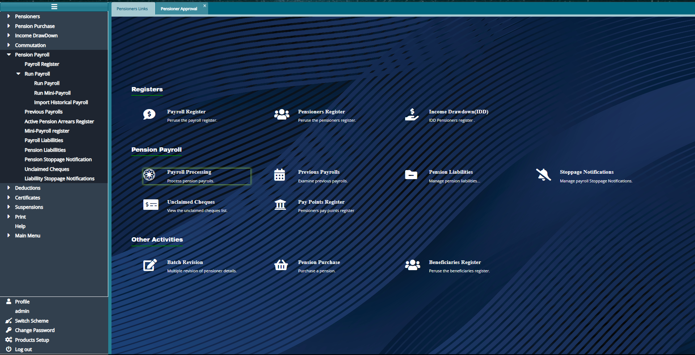
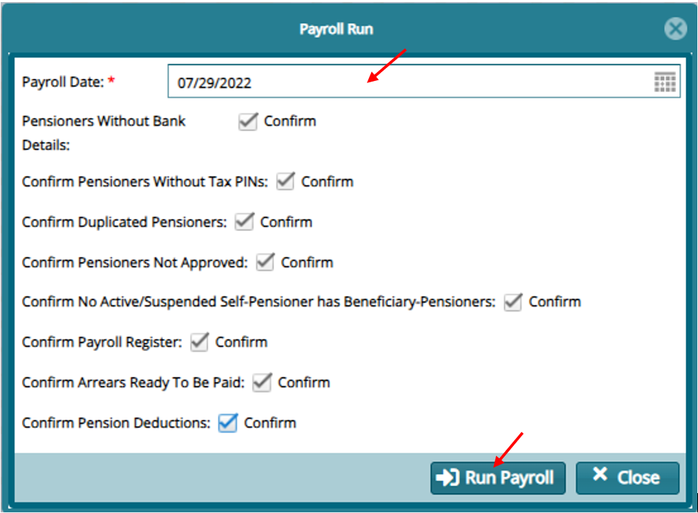
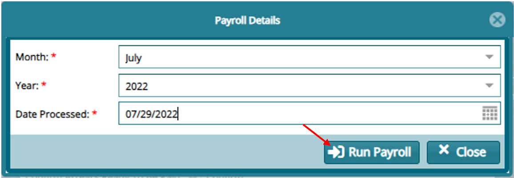
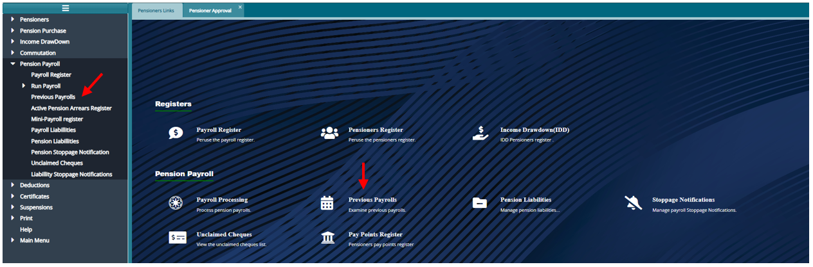
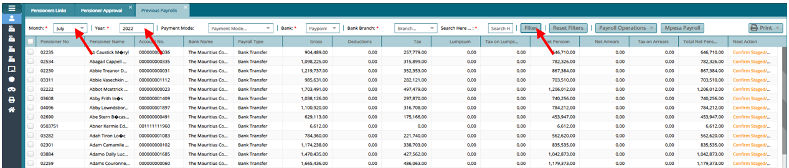
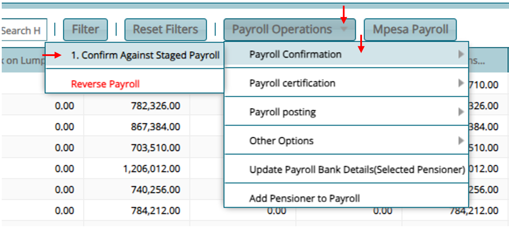
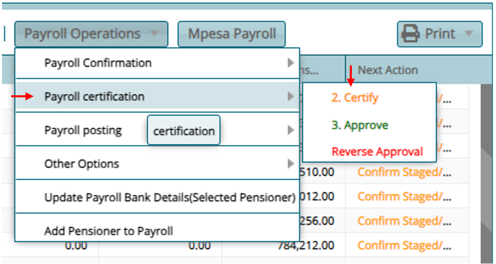
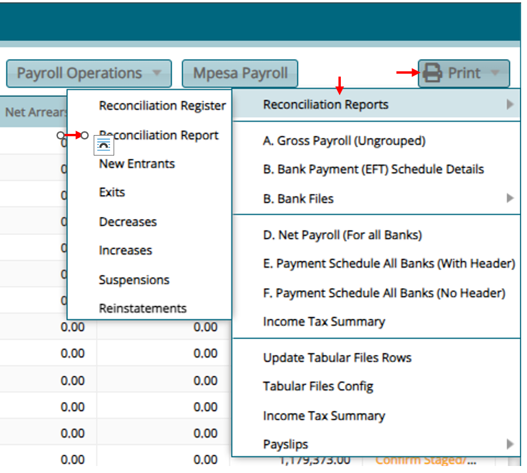
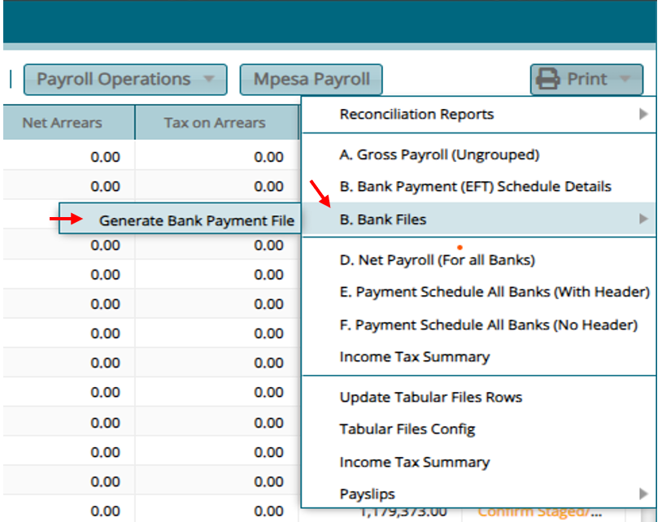
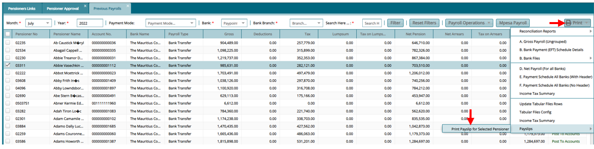

### Running Payroll

1.  To Run Payroll from The Hot links, click on **"Processing Payroll"** or from the left panel click on **"Pension Payroll"** then **"Run Payroll"**

2.  On the window that opens input the payroll date and click on the check box to do confirmations. Then click on **"Run Payroll"**

-   Provide the Month, Year and Date processed in the window that opens and click **"Run Payroll"**

3.  To view the Payroll from The Hot links, click on **"Previous Payroll"** or from the left panel click on **"Previous Payroll"** then **"Run Payroll"**

4.  From the register that opens input the month and year of the year that was processed and click on filter to view payroll

To perform Payroll operations.

5.  Click on Payroll Operations

    -   Confirm Against Staged Payroll -- Confirm Exceptions

-   Payroll Certification to Certify and Approve

6.  To print required Reports

    -   Click on **"Print"**

       -   Reconciliation Report

-   Bank File

-   Pensioner Pay slip

