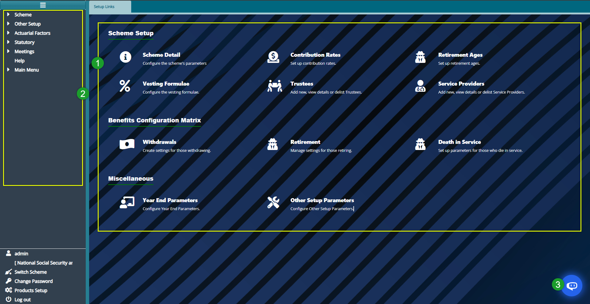

### Scheme Setup Module

The scheme setup module implements the trust deed and rules of a scheme. These rules are implemented in the system through configurations such as Basic Scheme Details, Contribution Rates, Benefits Configuration Matrix etc.

To access the Scheme Setup dashboard, click the '**Scheme Setup'** link on the landing page to open the '**Setup Links'** Window. Below is a screenshot of the Scheme Setup dashboard:

  

**Action**

-   Click on the hot links under the section **'labeled 1'** to access shortcut routes to commonly visited links in the scheme setup module.

-   Click on the menu items listed on the left side pane in the section **'labeled 2'** to configure all Scheme Setup-related settings.

-   Click on the button **'labeled 3'** to access the system's Intelligent Assistant (IA) chatbot.

**Tip**

All the links under **'label 1'** can still be accessed on the left side pane although some are tacked under sub-menus.