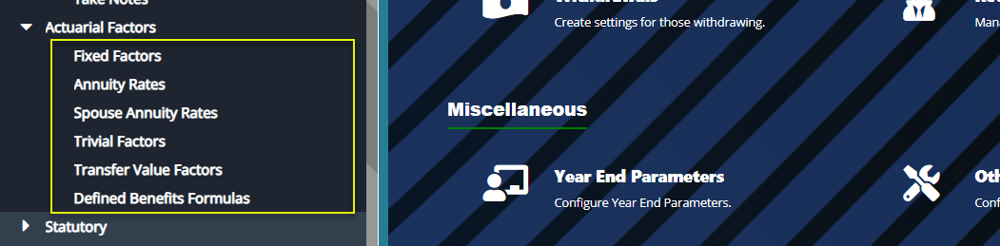
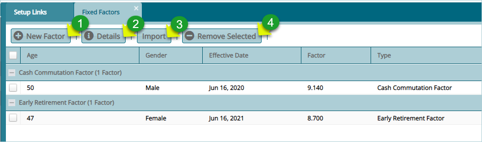
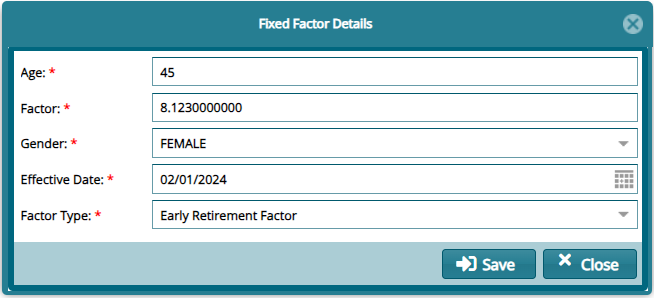
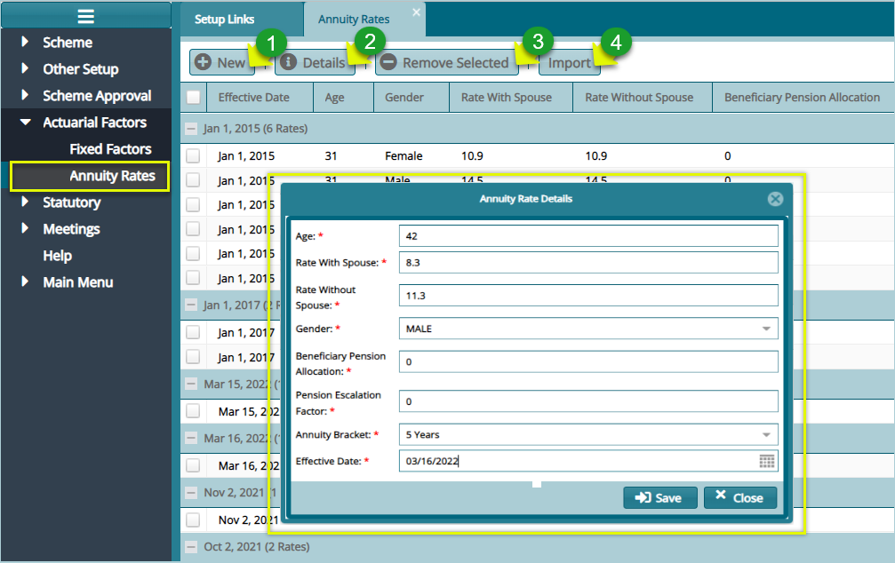
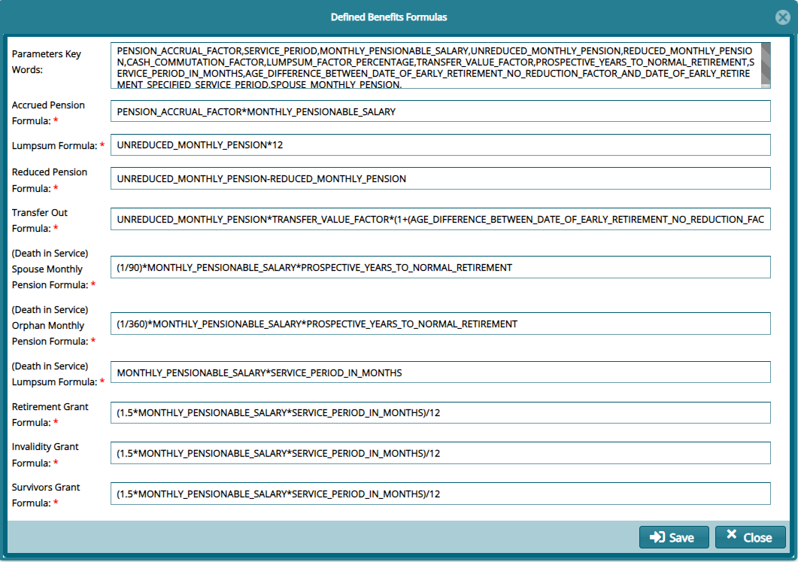

### Actuarial Factors

The **'Actuarial Factors'** set of configurations aids in setting up
Actuarial Factors that are used in DB and DC lump sum calculations.
Click on the links under the drop-down menu to set different actuarial
rates and factors as shown below:

  

## Fixed Factors

The **'Fixed Factors'** are provided by the scheme actuaries and aid in
the calculation of member benefits based on the retirement age and the
gender type.

Click the **'Fixed Factors'** link to open the fixed factors window to
view a list of set factors and to create new factors as shown below:

  

**Action**

-   Click **label 1** button to create a new fixed factor.

-   Click **label 2** button to view the details of a selected factor
    from the list.

-   Click **label 3** button to upload already prepared factors in a
    template.

-   Click **label 4** button to remove a selected factor from the list.

Click the **'New Factor'** button to open a dialog box to add a new fixe
factor as shown below:

  

## Annuity Rates

Annuity rates are provided by third-party insurance companies with the
help of internal or external actuaries to aid in the calculation of
annuities' purchase prices. Click the **'Annuity Rates'** link to open
the Annuity Rates dialog box to set a new rate as shown below:

  

**Action**

-   Click **label 1** button to create a new annuity rate.

-   Click **label 2** button to view the details of a selected annuity
    rate from the list.

-   Click **label 3** button to remove a selected factor from the list.

-   Click **label 4** button to upload already prepared annuity rates in
    a template.

## Spouse Annuity Rates

## Trivial Factors

## Defined Benefits Formulas

This dialog form enables the setting of key formulas in defined benefits
schemes:

  