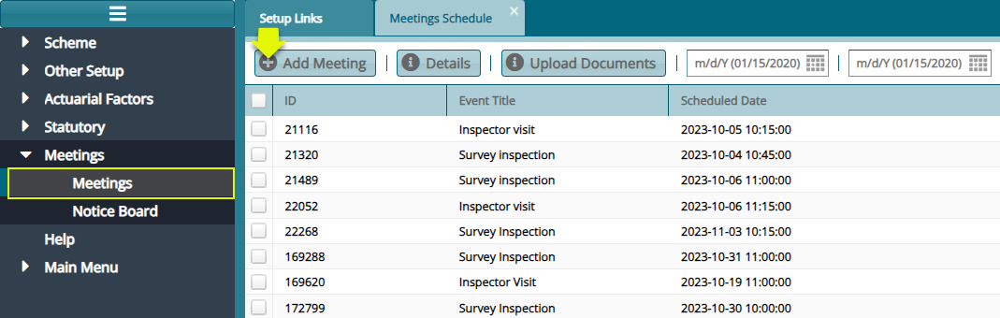
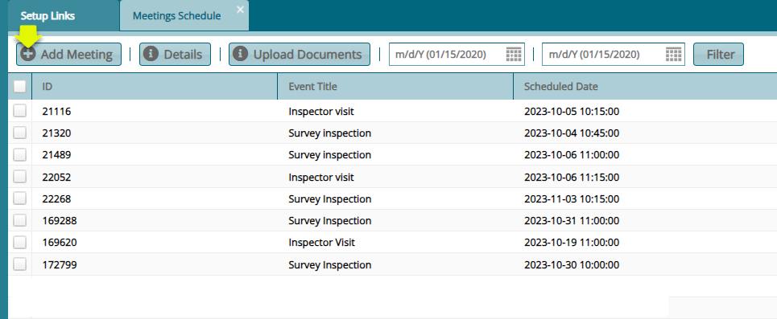
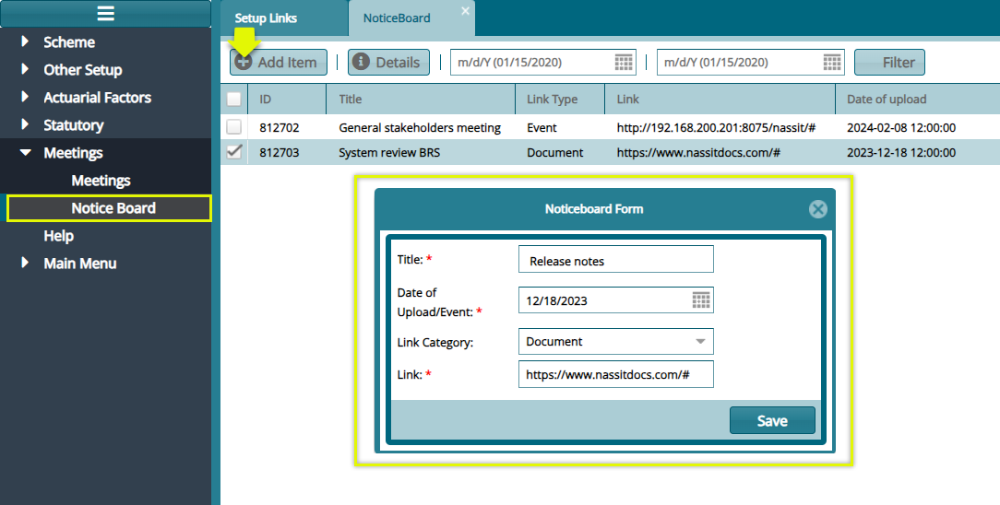

The **'Meetings'** schedule window lists all schedulled meetings in a scheme. 

Click the **'Meetings'** menu item to open the meetings schedule window
to view a list of scheduled meetings as shown below:

  

To schedule a new meeting, click the **'Add Meeting'** button to open a
dialog box to capture the details of a new meeting:

## Meetings

Click the **'Meetings'** link to open a window where all scheduled
meetings are listed. Clicking the **'Add Meeting'** button will open a
dialog box for capturing the details for a new meeting schedule. See
screenshot below:

  

## Notice Board

Click the **'Notice Board'** link to open a window where all items on
the notice board are itemized. Clicking the **'Add Item'** button will
open a dialog box for capturing the details of a new item. See
screenshot below:

 