### Other Setup

Configurations under **'Other Setup'** menu enable formulation of
interests, penalties, setting up pay points, actuarial valuations, among
others. The screenshot below shows a drop-down menu where various links
are located:

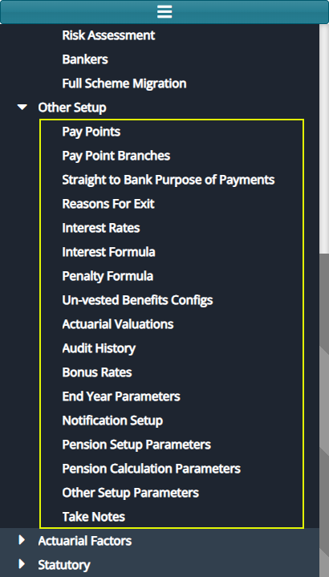  

### Pay Points

Click the **'Pay Points'** link to open a Pay Points window and then
click the **'New Pay Point**' button to capture details for a new pay
point as shown below:

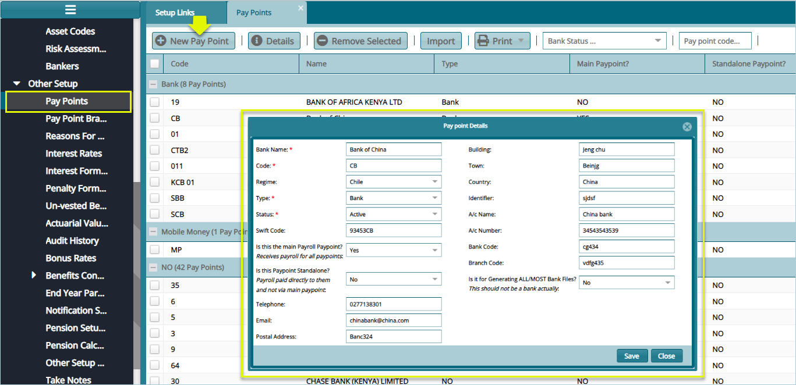  

### Pay Point Branches

Click the **'Pay Points Branches'** link to open a pay point branches
window and then click the **'Pay Point Branch'** button to capture
details for a new pay point branch as shown below:

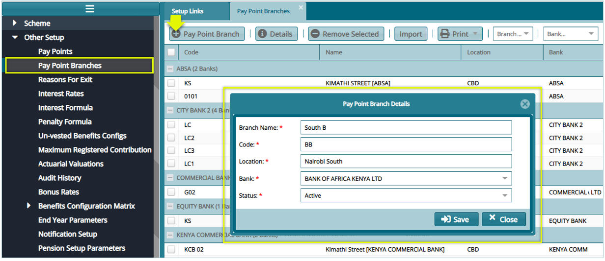  

## Straight to Bank 

Click the **'Straight to Bank Purpose of Payments'** link to open a
dialog box for capturing the purpose of a straight to bank type of
payment. See the screenshot below:

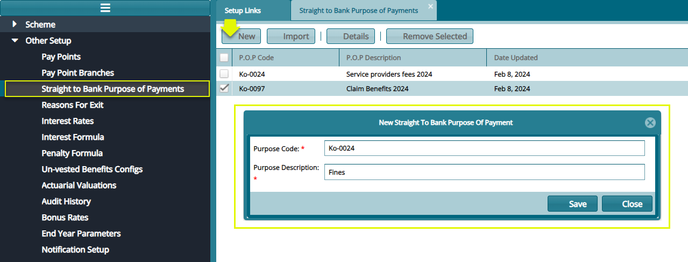  

## Reasons for Exit

Click the **'Reasons for Exit'** link to open the Reasons for Exit
window where a grid table displays the various reasons for exit
configurations. See the screenshot below:

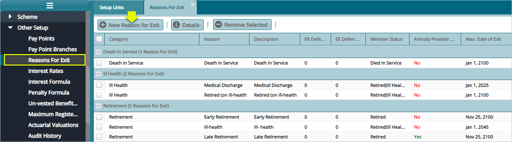  

Click the **'New Reason for Exit'** button to open a dialog box through
which a new exit reason is configured as shown below:

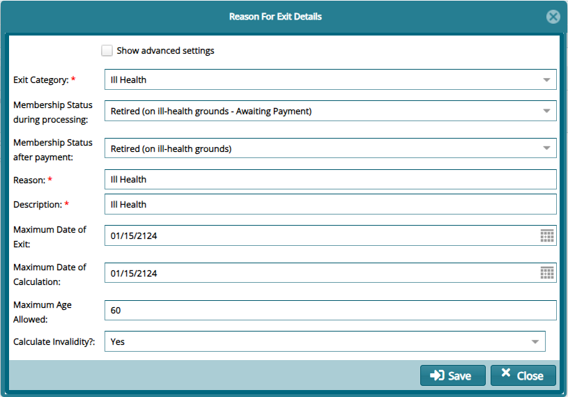  

### Interest Rates

Click the **'Interest Rates'** menu item to open the Interest Rates
window to view the details of rates already configured in the scheme as
shown below:

  

Click the **'New Interest Rate'** link from the **'Operations'**
drop-down menu as shown in the previous screenshot to open a dialog box
through which a new interest rate can be defined as shown below:

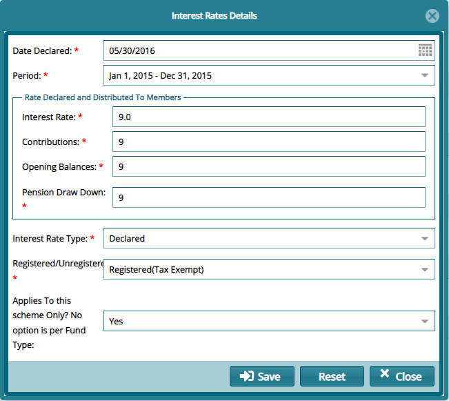  

### Interest Formula

Click the **'Interest Formula'** link to open the interest formula
window, then click the **'New Formular'** button to create a formula as
shown below:

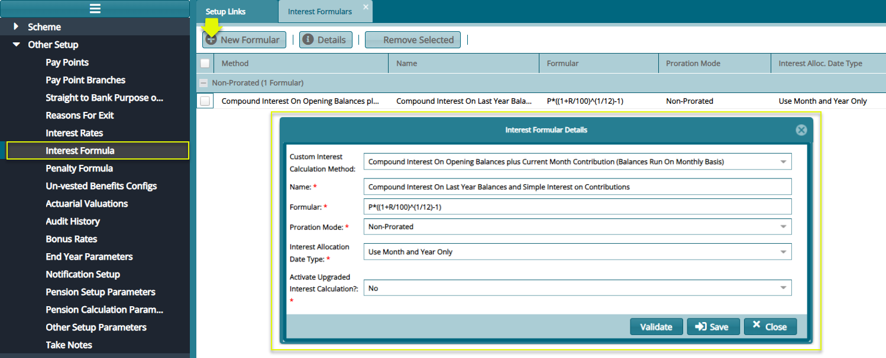  

### Unvested Benefits configs

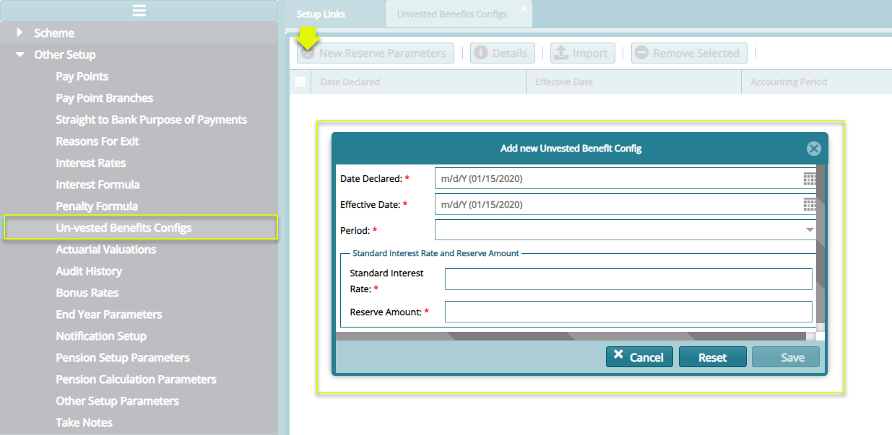  

### Actuarial valuation

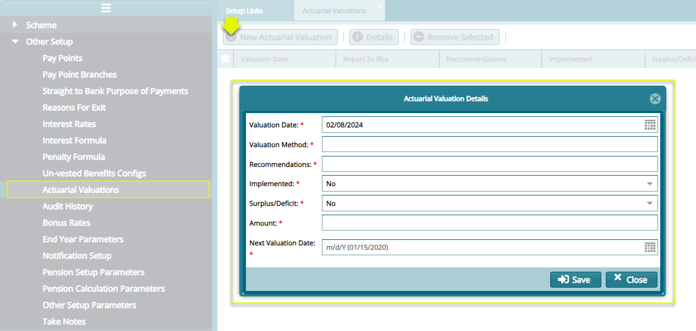  

### Audit History

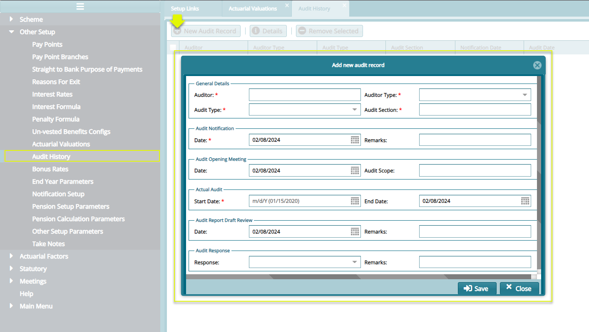  

### Bonas Rates

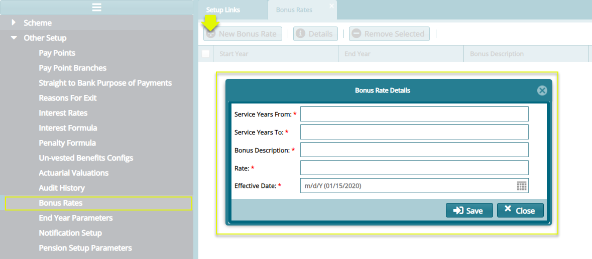  

## End of Year Parameters

This set of configurations determine the benefits calculation method for
end of the defined financial year i.e., interim and declared rates of
interest. Interest allocation frequency and distribution mode are other
important parameters set here.

Click the **End Year Parameters** link to open the Year-End Parameters
Details dialog box and configure the details as shown in the sample
screenshot below:

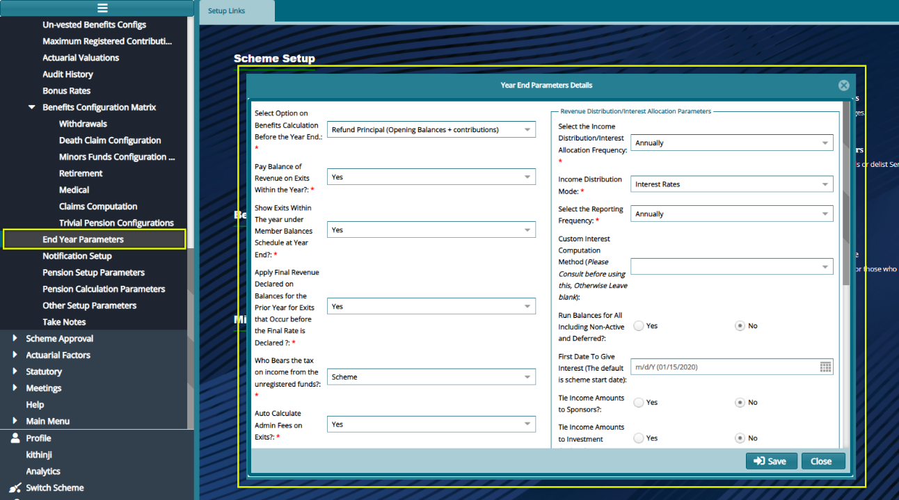  

**Parameter description**

-   **Select option on withdrawal benefit calculation before the
    year-end:** on the drop-down menu select provisional rate of
    interest, lock benefits in the scheme year-end, or refund
    principal (opening balances + Contributions)

-   **Show withdrawals within the year under the member balances
    schedule at year-end?** Specify whether to show withdrawals within
    the year under the member balances end-of-year schedule.

-   **Who bears the tax on income from the unregistered funds?** Specify
    who bears the taxation on the unregistered fund's portion, the
    scheme, or individual members.

-   **Auto calculates administration fees on withdrawals?** Specify
    whether the administration fees must be auto calculated for the
    administration services.

-   **Treat tax from the unregistered scheme as an expense?** Specify
    whether the tax on the unregistered portion must be treated as an
    expense.

### Notification Setup

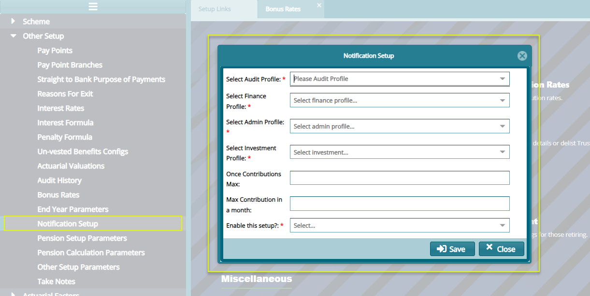  

## Pension Setup Parameters

Click the **'Pension Setup Parameters'** link to open the Pension Setup
Parameters dialog window and set the configurations as shown in the
screenshot below:

  

## Pension Calculation Parameters

Click the **'Pension Calculation Parameters'** link to open a dialog
window and set the configurations as shown in the screenshot below:

  

## Other Pension Parameters

Click the **'Other Pension Parameters'** link to open a dialog window
and set the configurations for Lumpsum Tax-Free and other related items
as shown in the screenshot below:

  

**Action**

-   Click **label 1** button to load a dialog box and set a new
    **Lumpsum Tax Free** configuration as shown above.

-   Click **label 2** button to open a dialog box and set a new
    **Pension Tax Free** configuration.

-   Click **label 3** button to open a dialog box and set a new
    **Pension Accrual Factor** configuration.

-   Click **label 4** button to open a dialog box and set a new
    **Pension Service Periods Split Dates** configuration.

-   Click **label 5** button to open a dialog box and set a new
    **Lumpsum Tax Free** configuration.

## Take Notes

The **'Take Notes'** tool aids the system users to take some notes and
save them. To see the notes already written and capture new notes.

Click the **'Take Notes'** link to open the Notes window. From this
window locate and then click the **'New'** button to load a new dialog
box and type new notes as shown below:

  
