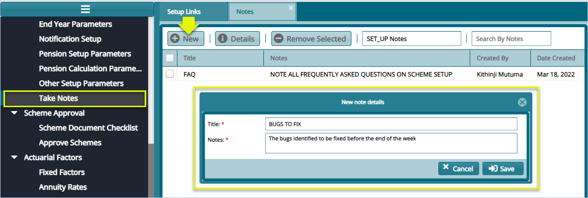

## Other Scheme Setup configs

Configurations under **Other Setup** menu enables formulation of interests, penalties, setting up pay points, actuarial valuations, etc. The screenshot below shows a drop-down submenu where various links are located:

 

## Pay Points

Click the **Pay Points** link to open a Pay Points window and then click the **New Pay Point** button to capture details for a new Pay Point as shown below:

 

## Pay Point Branches

Click the **Pay Points Branches** link to open a Pay Points Branches window and then click the **Pay Point Branches** button to capture details for a new Pay Point Branch as shown below:

 

## Reasons for Exit

Click the **Reasons for Exit** link to open the Reasons for Exit window where a grid table displaying various reasons for exit configurations. See scheenshot below: 

 

**Tips**

- The reason for exit configurations enables creation of various reasons for exit by a member in a scheme. These configs are then saved in the system for retrieval at the exit (movement) of the member (see initiate movement under the
members register module).

- The main reasons for exit are Withdrawal, Retirement, Death in Service and Medical. Each reason is tied to the benefits calculation.

Click the **New Reason for Exit** button to open a dialogue box through which a new exit reason is configured as shown below: 

 

## Interest Rates

Click the **Interest Rates** link to open the Interest Rates window to view the details of rates already configured in the scheme as shown below: 

 

Clicking the **New Interest Rates** link from the **Operations** drop-down menu as shown in the previous screenshot will open a dialogue box through which a new interest rate can be defined as shown below:

 

## Interest Formula

Click the **Interest Formula** link to open the Interest Formula window, then click the **New Formular** button to create a formular as shown below:

 

## Max Registered Contribution

Click the **Max Registered Contribution** link to open the Maximum Registered Contribution window, then click the New Max Registered Contribution button to create a configuration as shown below:

 

**Tips**

- This configuration is dependent on the regime where the system is used. For instance, in Kenya the salaried employees registered contribution amount is pegged at a maximum of KES. 20,000. 
  
- This means that any contribution above this amount is subjectable to tax. Click the highlighted link access the window through which a new configuration can be done as shown below:

Clicking the **New Max Registered Contribution** button will load a dialogue box through which a new configuration is set as shown below:

## End of Year Parameters

The End of Year parameters are set to determine benefits calculation method for end of defined financial year i.e., **Interim** and **Declared** Rates of Interest. Interest allocation frequency and distribution mode are other important parameters set here.

Click the **End Year Parameters** link to open the Year End Parameters Details dialog box and configure the details as shown in the sample screenshot below:

  

**Parameter description**

- Select option on withdrawal benefit calculation before the yearend: on the drop-down menu select provisional rate of interest, lock benefits in scheme till year end or refund principal (opening balances + Contributions)
- Show withdrawals within the year under member balances schedule at year end? Specify whether to show withdrawals within the year under the member balances end of year schedule.
- Who bears the tax on income from the unregistered funds? Specify who bears the taxation on the unregistered funds portion, the scheme or individual members.
- Auto calculates administrations fees on withdrawals? Specify whether the administration fees should be auto calculated for the administration services.
- Treat tax from the unregistered scheme as an expense? Specify whether the tax on the unregistered portion should be treated as an expense.

## Other Pension Parameters

Click the **Other Pension Parameters** link to open a dialog window and set the configurations for Lumpsum Tax Free and other related items as shown the screenshot below:

  

**Action**

- 	Click **label 1** button to load a dialogue box and set a new **Lumpsum Tax Free** configuration as shown above.
-	Click **label 2** button to open a dialogue box and set a new **Pension Tax Free** configuration.
-	Click **label 3** button to open a dialogue box and set a new **Pension Acrual Factor** configuration.
-	Click **label 4** button to open a dialogue box and set a new **Pension Service Periods** Split Dates configuration.
-	Click **label 5** button to open a dialogue box and set a new **Lumpsum Tax Free** configuration.

## Pension Calculator Parameters

Click the **Pension Calculation Parameters** link to open a dialog window and set the configurations as shown the screenshot below:

  

## Pension Setup Parameters

Click the **Pension Setup Parameters** link to open the Pension Setup Parameters dialog window and set the configurations as shown the screenshot below:

  

## Take Notes

This configuration helps the system users to take some notes and save them. To see the notes already written and capture new notes.

Clicking the **Take Notes** link will open the Notes window. From this window locate and click the **New** button to load a new dialogue box and type new notes as shown below:

 
