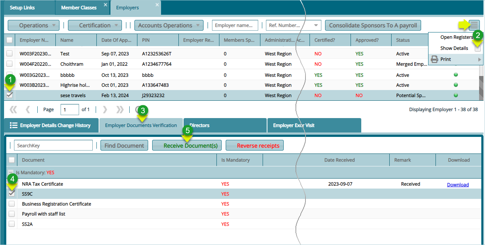

### Scheme

Access to all scheme configurations is provided for by clicking the
**'Scheme'** menu on the left side pane. This will open a dropdown menu
which is organized into submenu categories, providing a convenient order
of configurations. See screenshot below:

  

**Action**

-   Click a link under the left side pane to open a dialog box through
    which a specific scheme setting can be configured.

## Scheme Register

The **'Schemes Register'** lists all the schemes created in the system.
From the scheme window, several actions can be taken on selected schemes
such as cloning of a scheme's configuration, certification, and
migration of a scheme among others. From this window a new scheme can
also be created. The screenshot below shows how the scheme register
looks like:

  

**Action**

-   Click on the label 1 menu to open a drop-down list with actions for
    selected schemes.

-   Click on the label 2 button to launch a dialogue box for creating a
    new scheme.

-   Click on the label 3 menu to open a drop-down for certifying and
    approving selected schemes.

-   Click on the label 4 text field and enter keywords to filter records
    by name.

-   Click on the label 5 menu to open a drop-down to select approved or
    not approved records.

-   Click on the label 6 menu to open a drop-down list of registers.

-   Click on the label 7 menu to open a drop-down for cloning scheme
    configurations.

-   Click on the label 8 button to load a section with more details of a
    selected scheme from the register.

## Operations

The '**Operations**' menu provides links to open windows for various
actions related to schemes. These actions include tasks like capturing a
scheme's bank details and initiating the scheme migration process. See
the screenshot below:

  

### New Scheme

To create a new scheme, click the **'New Scheme'** button to launch
the Scheme Details dialog box. In this dialog box, critical
configurations can be set, as illustrated below:

  

**Tips**

-   The **'Take On Date'** is configured to determine the financial
    periods while the **'Date of Commencement'** denotes the start of the
    scheme.

### Scheme Certification

The '**Certification**' menu provides access to the buttons through
which a newly created scheme is certified and approved before further
configurations can be done. See screenshot below:

  

**Action**

-   To Certify or Approve a scheme, select it from the scheme register
    grid table. From the **'Certification'** drop-down menu, select
    **'Certify'** or **'Approve'** menu links and click.

### Open Registers

The **'Open Register'** menu offers links to open windows displaying
various basic registers related to schemes. These registers may include
information such as employer details and billing addresses. See the
screenshot below:

  

## Employer Management

### Employer Enrollment

To enroll a new employer into a scheme, locate the **'Open Registers'**
drop-down menu, as shown in the previous screenshot, and click the
**'Employers'** menu item. This will open the employers window where
their details are displayed as shown below:

  

**Action**

-   Click on the **label 1** button and from the drop-down select an
    option to initiate a process such as adding a new employer.

-   Click on the **label 2** button and from the drop-down menu select
    the option to certify and approve the registration of a newly added
    employer.

-   Click on the **label 3** button and from the drop-down list select
    to merge employer accounts among other accounts related actions.

-   Click on the **label 4** button push all the employers under a
    selected employer into a payroll.

-   Click on the **label 5** menu to select an option such as initiating
    the inspection process.

-   click on the **label 6** icon to open a section showing extra
    details for a selected employer.

## Onboarding a Single Employer 

Click the **'New Employer'** link to open a form where the details of a
new employer are captured into the system as shown below:

  

Clicking the **'Save'** button on the employer details form upon
completion of capturing the details will load a form for scheduling a
meeting. Fill in the meeting information and save as shown below:

  

## Onboarding Employers in Batch 

Employers can also be onboarded into the system in batch form using a
template. To initiate this process, click on the **'Import from
Template'** menu item as shown below:

  

### Employer Documents Checklist

Click the **'Employer Documents checklist'** link to open a window where
all documents needed for employer enrollment are listed. Clicking the
'**New Document**' button will open a dialog box for capturing the
details for a new document as shown below:

  

### Receiving Enrollment Documents

After a new employer has been created in the system, all the documents
needed for registration need to be uploaded into the system. To upload
the documents, follow the steps demonstrated in the following
screenshot:

  

 **Action**

-   Click **label 1** to select the employer whose enrollment documents
    you want to receive.

-   Click **label 2** checklist button to load a section on the lower
    side of the window showing the details of a selected employer.

-   Click **label 3** tab to see the mandatory documents that need to be
    received.

-   Click **label 4** checklist to select the document that needs to be
    uploaded.

-   Click **label 5** button to open a dialog box through which the
    document is uploaded to the system.

Clicking the **'Receive Documents'** button, will open a dialog box for
through which the required document is uploaded into the system as shown
below:

  

### Details Tabs

*Employer Change History*

  

*Employer Documents Verification*

  

*Directors*

  

*Employer Exceptions*

  

*Schedule Employer Visit*

  

### Supervisor

Click the **'Supervisors'** link to open a window where all supervisors
details are listed. Clicking the **'New Supervisor'** from the
**'Operations'** drop-down menu will open a dialog box for capturing the
details for a new supervisor as shown below:

  

### Inspectors

Click the **'Inspectors'** link to open a window where all Inspectors
details are listed. Clicking the **'New Inspector'** from the
**'Operations'** drop-down menu will open a dialog box for capturing the
details for a new Inspector as shown below:

  

### Cost Centers

The **'Cost Center'** window lists all the cost centers created for
different sponsors. From this window, new cost centers can be created
among other actions related to cost centers. See screenshot below:

  

### New Cost Center

To create a new cost center, click the **'New Cost Center'** button, as
shown on the previous illustration, to open a dialog box to capture the
details of the cost center as shown below:

  

Click the **'Lookup Sponsor'** button to select the sponsor whose cost
center is being created for. This action will open a window for
selecting the sponsor. Click the **'Apply Selected Sponsor'** button to
tie the sponsor to the new cost center as shown below:

  

### Member Classes

The **'Member Classes'** window lists all the member classes created for
different categories of members under a sponsor. From this window, new
member classes can be created among other actions related member
classes. See screenshot below:

  

### New Member Class

To create a new cost center, click the **'New Member Class'** button, as
shown on the previous illustration, to open a dialog box to capture the
details of the member class as shown below:

  

Click the **'Lookup Sponsor'** button to select the sponsor whose member
class is being created for. This action will open a window for selecting
the sponsor. Click the **'Apply Selected Sponsor'** button to tie the
sponsor to the new member class created as shown below:

  

### Scheme Details

Clicking the '**'Show Details'** button (see previous illustration) after
selected an employer from the list, will open a section where extra
details regarding a selected employer can be viewed as shown below:

  

**Action**

-   Click on a tab such as the **'Director'** tab, **'Employer Visit'** tab
    etc. to view related information.

-   From this section actions such as receiving documents and adding a
    director can be achieved.

## Configurations

The **'Configurations'** menu allows access to some of the key
configurations that need to be set for the scheme to execute
effectively. See the screenshot below:

  

### Scheme Configurations

The **'Scheme Configurations'** are those that determine how a scheme is
to be set up. Click the 'Scheme Configurations' menu link to open the
'Scheme Configurations' window set the required parameters for different
subsets such as **'Basic Scheme Details'**, **'Members Configurations'**
among others as shown below:

  

**Action**

-   Click **label 1** tab to load the **Basic Scheme Configurations** window to set the appropriate parameters.

-   Click **label 2** tab to load the **Scheme Setup Configurations** to set the appropriate parameters.

-   Click **label 3** tab to load the **Member Configurations** to set the appropriate parameters.

-   Click **label 4** tab to load the **Contributions and Balances Configurations** to set the appropriate parameters.

-   Click **label 5** tab to load the **Claims and Pensioners Configurations** window to set the appropriate parameters.

-   Click **label 6** tab to load the **Scheme Dates and Insurance Covers Configurations** window to set the appropriate parameters.

-   Click **label 7** tab to access other configuration tabs.

### Global Configurations

The **'Global Configurations'** are set of parameters that affect all
schemes in FundMaster when configured. Click the 'Global Configurations'
menu link to open a configurations window and set the required
parameters as shown below:

  

### Benefits Configurations

The **'Benefits Configurations'** are those that determine members
benefits are calculated at the point of exiting a scheme. Click the
'Benefits Configurations' menu link to open the configurations window to
set the required parameters for different subsets such as **'Medical Configurations'**,
**'Death Claim Configurations'** among others as shown below:

  

**Action**

-   Click **label 1** tab to load a window for setting *Death Claim
    Configurations* parameters.

-   Click **label 2** tab to load a window for setting *Retirement
    Configurations* parameters.

-   Click **label 3** tab to load a window for setting *Trivial Pension
    Configurations* parameters.

-   Click **label 4** tab to load a window for setting *Medical
    Configurations* parameters.

-   Click **label 5** tab to load a window for setting *Claims
    Computation Configurations* parameters.

### Contribution Configuration Matrix

The **'Contribution Configuration Matrix'** is a window where
different sets of configurations related to a scheme members'
contributions management are configured. Click the **'Contribution
Configurations matrix'** menu link to open the configurations window to
set the required parameters for different sets such as '*Severance Due
Entitlement'*, '*Contribution Refunds'* among others as shown below:

  

**Action**

-   Click **label 1** tab to load a window for setting '*Severance Due
    Entitlement'* parameters.

-   Click **label 2** tab to load a window for setting '*Underpayments
    Threshold'* parameters.

-   Click **label 3** tab to load a window for setting '*Social Security
    Configurations'* parameters.

-   Click **label 4** tab to load a window for setting *'Contributions
    Receipting Bank'* details.

-   Click **label 5** tab to load a window for setting '*Contributions
    Refunds'* parameters.

## Incomed Drawdown Scheme Setup

Clicking the **'Income Drawdown Scheme Setup'** menu, shown below, will
open the 'Additional IDD scheme'. See the dialog box in the next image.

  

Below is the **'Additional IDD scheme'** dialog box for configuring IDD
scheme details:

  

## Module Allowance Configurations

The set of configurations under the **'Module Allowance Configuration'**
menu, shown below, determine whether a scheme is allowed access to some
extra modules.

  

Clicking the **'Module Allowance Configuration'** menu will open a
dialog box where the configurations are done as shown below:

  

## Districts, Regions, and Trustees Details

To capture the details pertaining a scheme's served districts, villages,
regions, and the scheme trustees, click the respective menu items as
shown in the screenshot below:

  

### Districts

The **'Districts'** window facilitates the input of details pertaining
to districts covered by a scheme, specifically in terms of membership.
These details are captured as illustrated below:

  

**Action**

-   Click **label 1** menu button to display a drop-down list with links
    to create a new district, import districts in a template, viewing
    details of a selected district, or delete a selected district.

-   Click **label 2** button to create a traditional authority within a
    selected district.

-   Click **label 3** button to import, via a template, more than one
    traditional authority for a selected district.

-   Click **label 4** search box to type and search a district by name.

-   Click **label 5** button to hide or display the lower section of the
    window where traditional authorities in a district are listed.

-   Click **label 6** button to view the details of a selected
    traditional authority

-   Click **label 7** button to delete a selected traditional authority.

### Villages

The **'Villages'** window facilitates the input of details pertaining
to villages covered by a scheme, specifically in terms of membership.
These details are captured as illustrated below:

  

**Action**

-   Click **label 1** button to capture the details of a new village.

-   Click **label 2** button to import the details of more than one
    village via a template.

-   Click **label 3** button to view the details of a selected village
    from the list.

-   Click **label 4** button to delete a selected village from the list.

-   Click **label 5** button to filter a village by name from the list.

### Regions

The **'Regions'** window facilitates the input of details pertaining
to regions covered by a scheme, specifically in terms of membership.
These details are captured as illustrated below:

  

**Action**

-   Click **label 1** button to display a drop-down list where links to
    trigger the processes of creating a new region, viewing details of a
    selected region, or deleting one from the list are located.

-   Click **label 2** search box to type and search a region by name.

-   Click **label 3** button to hide or display the lower section of the
    window where subregions are listed.

-   Click **label 4** search box to filter a subregion by name.

### Trustees

The **'Trustees'** window shows the records with the scheme trustees.
From this window, new trustees can be added to the system. see
screenshot below:

  

**Action**

-   Click **label 1** button to capture a new trustee's details.

-   Click **label 2** to view the details of a trustee selected from the
    list.

-   Click **label 3** to delete selected trustees from the list.

-   Click **label 4** to upload support documents for a selected
    trustee.

-   Click **label 5** to view documents for a selected trustee.

Clicking the **'New Trustee'** button will open a dialog box for
capturing the trustee's details as shown below:

  

Clicking the **'Upload Document'** button will open an upload window for
selecting the type of document to upload to the system as shown below:

  

After selecting the type of document to upload, click the browse button
to give a path for uploading a document from your device as shown below:

  

The window below shows a list of all uploaded documents:

  

## Service Providers

The links under the **'Service Providers'** drop-down menu aid in
capturing and managing a scheme's various service prover details. The
screenshot below shows a drop-down menu with links to various
configurations windows:

  

### Fund Managers

The **'Fund Managers'** menu provides a window through which the details
of contracted scheme fund managers are captured as shown below:

  

**Action**

-   Click **label 1** button to capture the details of a fund manager.

-   Click **label 2** to view the details of a selected fund manager
    from the list.

-   Click **label 3** to delete a selected fund manager from the list.

-   Click **label 4** to load a dialog box for capturing payment
    details.

-   Click **label 5** to view management fee details.

### New Fund Manager

Clicking the **'New Fund Manager'** button, as shown in the previous
screenshot, will load a dialog box for capturing the details of a new
Fund Manager as shown below:

  

### Pay Management Fee

Clicking the **'Pay Management Fee'** button, as shown in the previous
screenshot, will load a dialog box for capturing the payment details as
shown below:

  

### Custodians

The **'Custodian'** menu provides a window through which the details of
contracted scheme custodians are captured as shown below:

  

**Action**

-   Click **label 1** button to capture the details of a new custodian.

-   Click **label 2** to view the details of a selected custodian from
    the list.

-   Click **label 3** to delete selected a selected custodian from the
    list.

Clicking the **'New'** button, as shown in the previous screenshot, will
load a dialog box for capturing the details of a new custodian as shown
below:

  

### External Pension Administrators

The **'External Pension Administrators'** menu gives access to the
Transfer Out Scheme window where records for all transferred schemes are
listed.

Clicking the **'New'** button will open a dialog box for capturing the
details of the external scheme as shown below:

  

### Legal Advisors

The **'Legal Advisors'** menu link provides access to a window through
which the details of contracted scheme Legal Advisors are captured as
shown below:

  

**Action**

-   Click **label 1** button to capture the details of a new legal
    advisor.

-   Click **label 2** to view the details of a selected legal advisor
    from the list.

-   Click **label 3** to delete selected a selected legal advisor from
    the list.

### Insurance/Annuity Providers

The **'Insurance/Annuity Providers'** menu provides access to the
**'Annuity Providers'** window where a list of providers is displayed.

Click the **'New'** button to open a dialog box and capture the provider
details as shown in the screenshot below:

  

### Brokers

The **'Brokers'** menu link provides access to the Brokers window where
records for different brokers are listed as shown below:

  

Click the **'New Broker'** button to open a dialog box and capture a new
broker's details as shown in the screenshot below:

  

### Other Service Providers

The **'Other Services Providers'** menu provides access to a window
where records for other service providers are listed as shown below:

  

**Action**

-   Click **label 1** button to capture the details of a new service
    provider.

-   Click **label 2** to view the details of a selected legal service
    provider from the list.

-   Click **label 3** to delete selected a selected service provider
    from the list.

## Enhancement Rates, Job Grades, Investments Options

  

### Enhancement Rates

  

## Job Grades

The **'Job Grades'** menu enables creation of job group profiles at the
pension administration level. See screen shot below:

  

**Action**

-   Click **label 1** button to create a new job grade.

-   Click **label 2** button to view details of a selected job grade.

-   Click **label 3** button to delete a selected job grade.

Clicking the **'New Job Grade'** button will open job grade dialog box
allowing the capturing of the title of a new job grade as shown below:

  

## Investments Options

  

## Member Class Specific Info

The configurations under **'Member Class Specific Info'** inform how a
member of a particular class in a scheme is treated apart from a member
from another class under the same employer. See screenshot below:

  

### Contribution Age Bands

To set contribution Age, click the **'Contribution Age Bands'** link and
then click the **'New Contribution Age Band'** button to add a new Age
band as shown below:

  

**Action**

-   Click **label 1** button to load a dialog box to set age band
    configuration.

-   Click **label 2** button to view the details of a selected record on
    the list.

-   Click **label 3** button to remove a selected configuration.

-   Click **label 4** button to view a print format copy of the
    Contribution age Band details.

### New Contribution Age Band

Click the **'New Contribution Age Band'** button labelled 1, to load a
**Contribution Age Band** **Details** dialog box through which a new age
band can be configured as shown below:

  

### Contribution Rates

To set contribution rates, click the **'Contribution Rates'** link and
then click the **'New Contribution Rates'** button to add a new rate as
shown below:

  

**Action**

-   Click **label 1** button to load a dialog box and set a new
    configuration.

-   Click **label 2** button to open a window for uploading contribution
    rates in a batch.

-   Click **label 3** button to view the details of a selected record on
    the list.

-   Click **label 4** button to remove a selected configuration from the
    list.

-   Click **label 5** button to search records based on the Sponsor
    (employer)

-   Click **label 6** button to Certify, Approve and Authorize a
    selected record.

-   Click **label 7** button to view a print copy of the Contribution
    Rates details.

### New Contribution Rates

Click the **'New Contribution Rates'** button labelled 1, to load a
Contribution Rates Details dialog box through which a new Rate can be
configured as shown below:

  

### Retirement Ages

The **'Retirement Ages'** configurations are set to categorize the
different types of retirement exits. This determines the benefits of a
retiree under each category during benefits processing. The following
screenshot shows a window displaying the already configured retirement
ages:

  

**Action**

-   Click **label 1** button to configure a new retirement age.

-   Click **label 2** button to view the details of a selected record.

-   Click **label 3** button to delete a selected configuration from the
    records.

-   Click **label 4** button to certify, approve and authorize a
    selected record.

### New Retirement Age

Click the **'New Retirement Age'** button to open a dialog box. Fill in
the details to create a new retirement age as shown below:

  

### Eligible Ages

The **'Eligibility Age'** is a configuration set to determine who can be allowed
in a member class in terms of age limits as shown below:

  

**Action**

-   Click **label 1** button to set a new eligible age.

-   Click **label 2** button to view the details of a selected record.

-   Click **label 3** button to delete a selected record.

### New Eligible Age

Click the **'New Eligible Age'** button to open a dialog box. Fill in
the details to create a new eligible age as shown below:

  

## Asset Codes

  

## Risk Assessment

The **'Risk Assessment'** tool aids in setting a scheme's risk
assessment questions. The feedback from the questions is used in risk
analysis to check the validity of new members joining a scheme. Clicking
the **'Risk Assessment'** menu item will open the Risk Assessment window
where a list of all risk related questions is displayed in a grid table.

### New Question

Click the **'New Question'** button to load a dialog box for typing in a
new question as shown below:

  

## Bankers

To set the scheme's bank details, click the **'Bankers'** link to open a
window listing banker's account records as shown below:

  

**Action**

-   Click **label 1** button to add a new bank record.

-   Click **label 2** button to view the details of a selected record.

-   Click **label 3** button to delete a selected record.

### New Scheme Bank

Then click the **'New Scheme Bank'** button to open a dialog box where a
new scheme bank details can be captured as shown below:

  

## Full Scheme Migration

The **'Full Scheme Migration'** window gives a platform where a new
scheme came be quickly set up by way of cloning configurations from a
scheme that is already operational in the system. Click the **'Full
Scheme Migration'** menu to open the migration setup window. See
screenshot below:

  

Clicking the **'Full Scheme Migration'** link will open the Full Scheme
Migration window as shown below:

  

**Action**

-   Click **label 1** button to initiate a new scheme migration.

-   Click **label 2** button to view the details of a selected migration
    record.

-   Click **label 3** button to delete a selected migration record.

-   Click **label 4** text box and type to search for a record by name.

-   Click **label 5** button to open a dropdown menu to initiate an
    action such as certifying a scheme migration process.

### New Migration

To migrate configurations and other data sets from the current scheme,
follow the steps below:

**Step 1:**

Check all the configurations and data set that need to be migrated as
shown in the screenshot below:

  

**Step 2:**

The illustration below shows how to select the scheme that inherits the
selected configurations as shown I the preceding step. Follow the
**'Actions'** shown below the screenshot:

  

**Action**

-   Click **label 1** button to load the scheme selection window.

-   Double Click **label 2** button to select the scheme that inherits
    the migrated attributes settings.

-   Click **label 3** button to initiate migration to multiple schemes.

-   Click **label 4** text box exit the window.