### Statutory

The **'Statutory'** configurations are tax rates that affect the
retirement benefits processes as defined by a regime's commissioner of
tax. The screenshot below shows a drop-down menu with links through
which different setups are done:

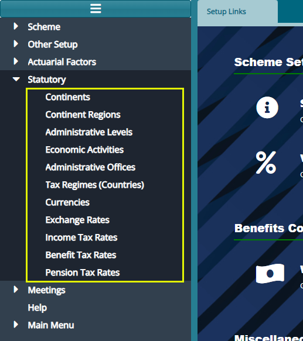  

## Continents

Click the **'Continents'** link to open the continents window, then
click the **'New Continent'** button to add a continent as shown below:

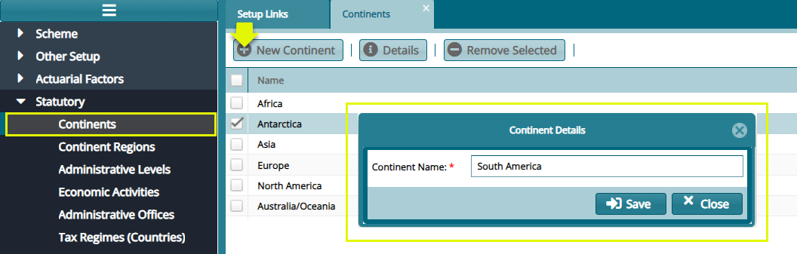  

## Continent Regions

Click the **'Continent Regions'** link to open the continents regions
window, then click the **'New Continent Region'** button to add a region
as shown below:

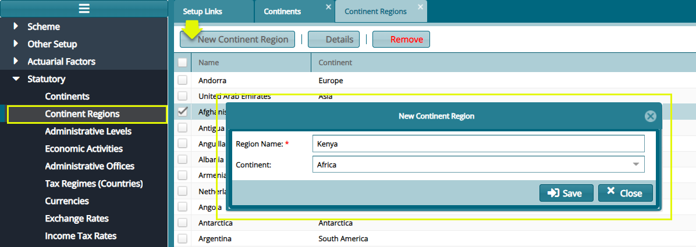  

## Administrative Levels

Click the **'Administrative Levels'** link to open the administrative
levels window to view different administrative level records as shown
below:

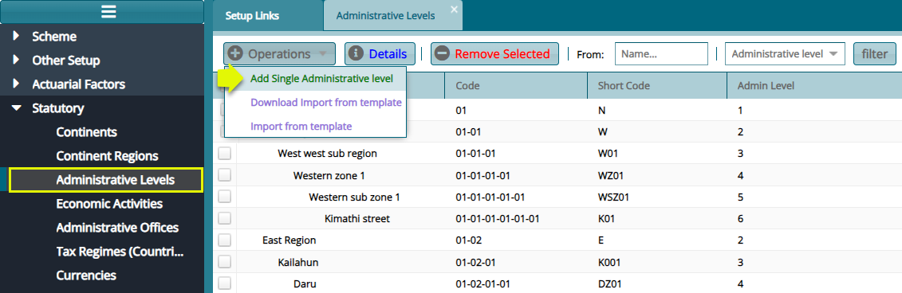  

Click the **'Add Single Administrative Level'** button to add an
administrative level shown below:

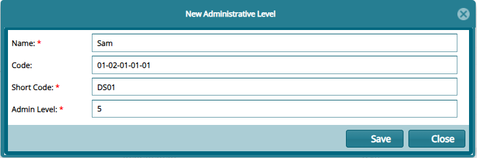  

## Economic Activities

Click the **'Economic Activities'** link to open the economic activities
window to view different economic activities as captured in the system.
see screenshot below:

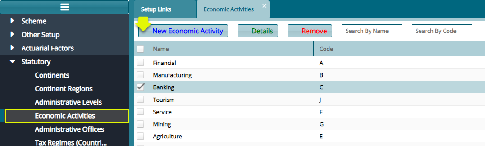  

Click **'New Economic Activity'** button to open a dialog box and
capture a new economic activity as shown below:

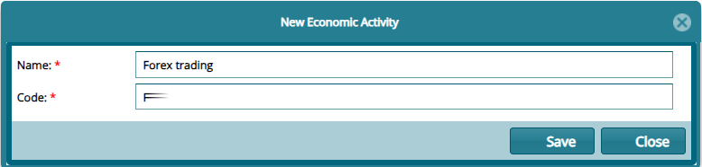  

## Administrative Offices

Click the '**Administrative Offices'** link to open the offices window
to view different office records as shown below:

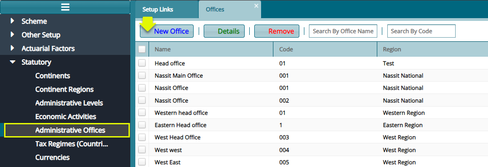  

Click '**New Office'** button to open a dialog box and capture the
details of a new office as shown below:

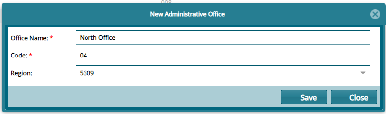  

## Tax Regimes

Click the **'Tax Regimes (Counties)'** link to open the tax regimes
window, then click the '**New Regime'** button to add a new regime as
shown below:

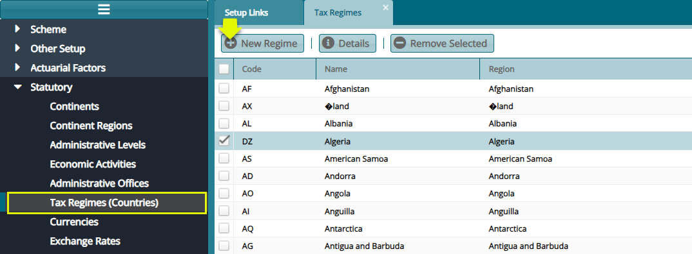  

## Currencies 

Click the **'Currencies'** link to open the currencies window, then
click the **'Add Currency'** button to add a new currency as shown
below:

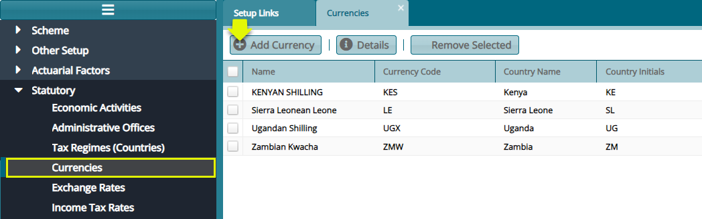  

## Exchange Rates

Click the **'Exchange Rates'** link to open the Exchange Rates window,
then click the **'New Exchange Rate'** button to add a new exchange rate
configuration as shown below:

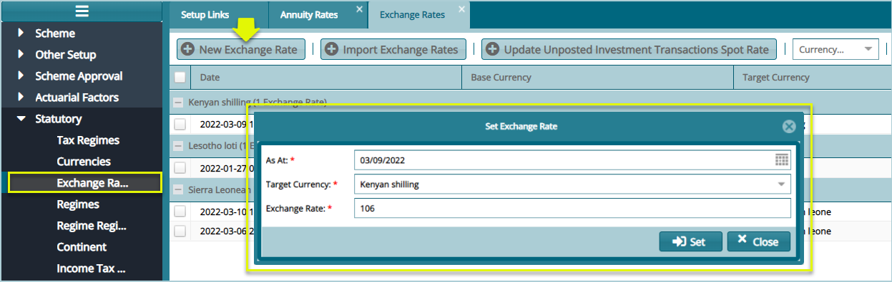  

## Income Tax Rate

Click the **'Income Tax Rates'** link to open the Income Tax Rates
window, then click the **'New Tax Rate'** button to define a new tax
rate as shown below:

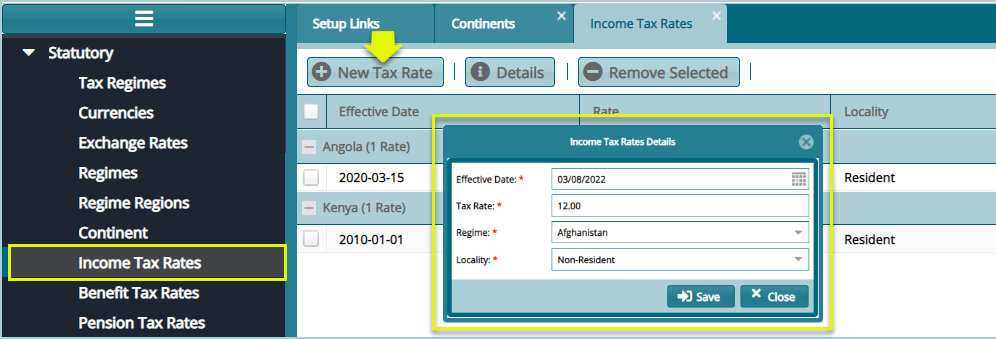  

## Benefits Tax Rates

Click the '**Benefits Tax Rates'** link to open the tax rates window,
then click the '**New Tax Header'** button and the '**New Tax Band'**
button to configure the tax header and band respectively as shown in the
following screenshot:

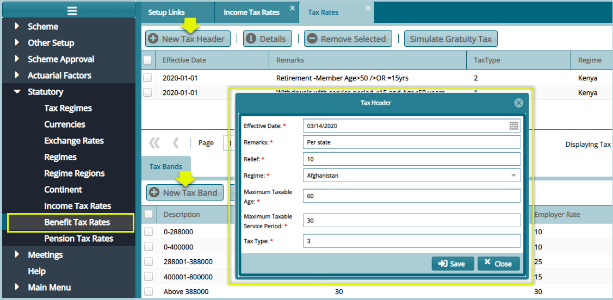  

**Tip**

The tax header's conditions and the tax headers are dictated by the
commissioner of taxes in each regime.

## Pension Tax Rates

The **'Pension Tax Rates'** set of configurations defines the pension
tax free amount and personal relief amount. Selecting a new tax band to
open a dialog box at the lower side of the window to aid in adding the
pension tax bands as shown below:

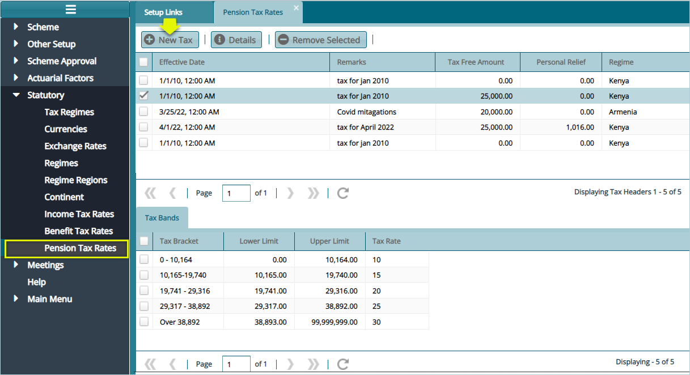  