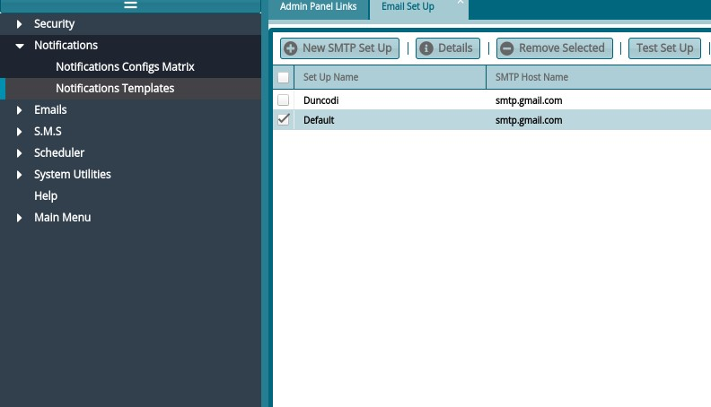
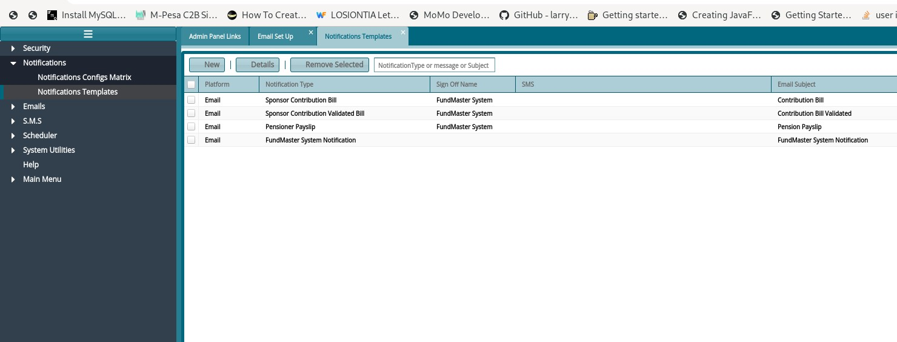
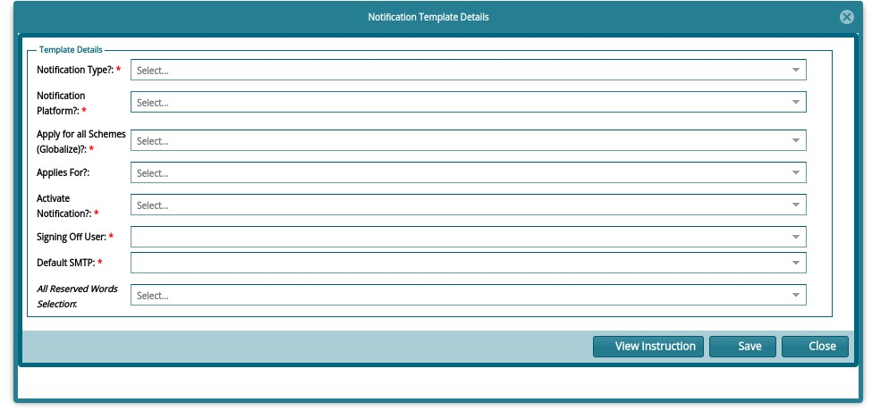
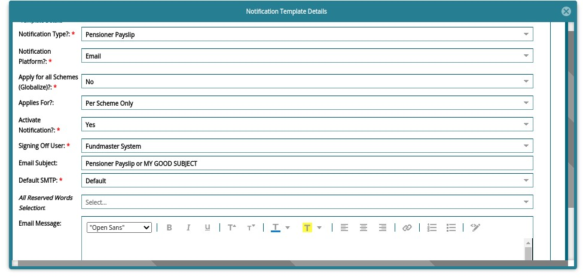
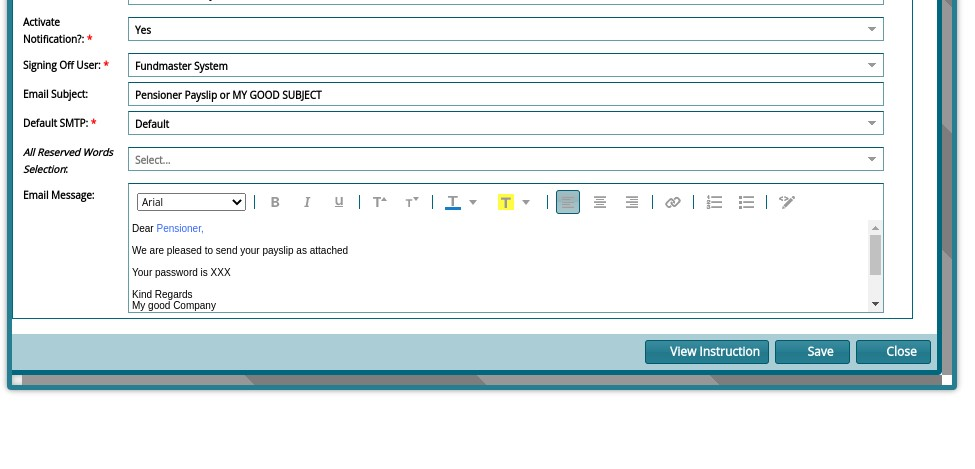

### Creating Notification Template

Access **Notification Templates** under **Notifications >> Notifications Templates**

 

See notification templates in the following window:

 

To Create a new one, Click on **New**

To Edit Existing one, click on **Details**

 

-   Select Notification Type: e.g., Pensioner Pay slip

-   Notification Platform: Email

-   Apply for all schemes? **No**

-   Applies For: **Per Scheme Only**

-   Activate Notification? **YES**

-   Signing off user: Select your username (will not appear in the email anyway)

-   Default SMTP: **Select your smtp**

-   By this time, you have an email subject and body appearing as shown

  

**NB:** Please Type in the email, don't copy paste. Format using available options on the email body. This will prevent special characters from copy pasting. Type in the whole body until Signature.

 

Your template is ready. Proceed to email your documents. Happy emailing!
