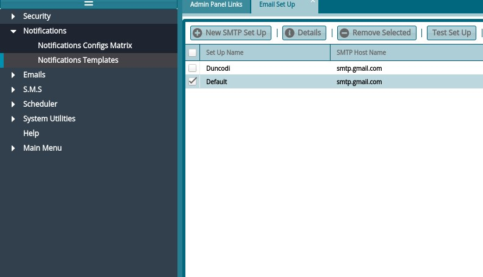

### SMTP Setup

To achieve this, do the following steps:

Step 1: Access Administrative Panel

  

See notificatiobs menu on the right side panel below:

 

Step 2: Access the Email Setup window

On the left pane, access **Email Setup** under **Emails** menu

 

See email setup window below:

 

**Step 3: Create a New Setup**

-   To Create a New Setup, click on **New SMTP Setup**

-   To Edit, Click on **Details**

  

***Legend***

-   *Details - Name of the setup, e.g. "My Favorite SMTP Config"*

-   *Host Name: Provided by ICT*

-   *Port: Provided By ICT*

-   *Authenticating User: A valid email address*

-   *Sending Email: Any email address (we recommend a valid one, in case a client wants to respond to it or if you don't want response, you can set as **[noreply@company.com]{.underline}**)*

-   *Allow Authentication: set to **Yes***

-   *Authentication Password: Valid **Authenticating User PASSWORD***

-   *Content Type: **HTML***

-   *Allow Notifications: **YES***

-   *Email Sender Name: Your favorite email sender name e.g. **My Good Company***

-   Save form

**Step 4: Test SMTP**

Test SMTP by clicking on **Test Set Up**

 

**Step 5: Set Default SMTP**

Set as default SMTP: Click on **Set as Default** Your correct setup should look like this list:

  

Notice the 3 YES, YES, YES

**Your emails are ready to go now. Happy Setup!**

