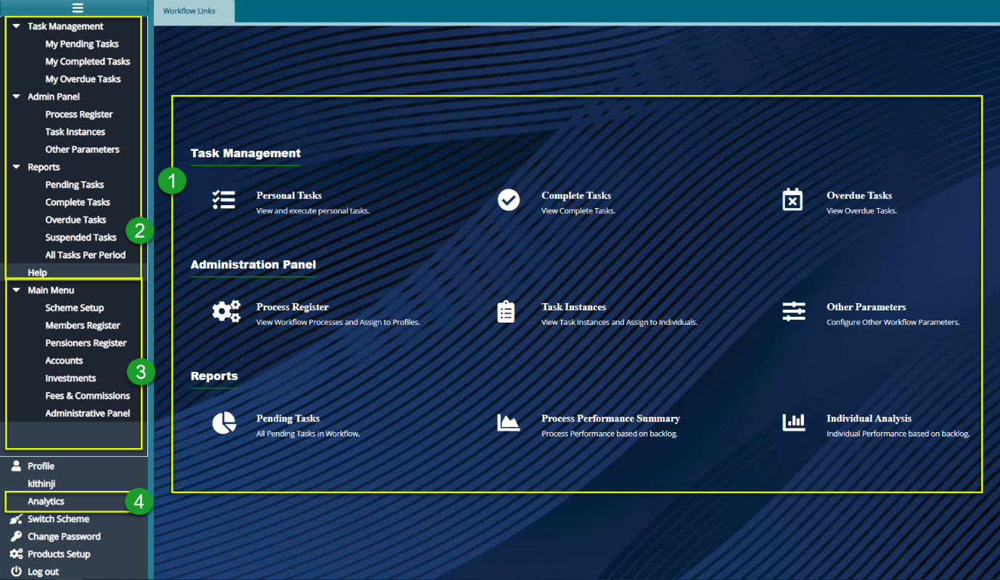
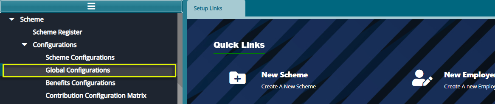
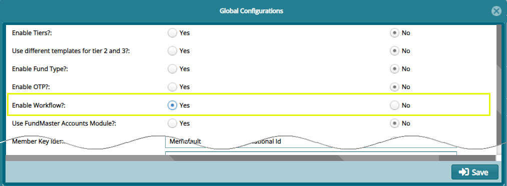

### Workflow Module

This workflow module enables a work distribution system that automates
all core processes such as claims, payroll processing, contribution, and
member registration. By assigning tasks to different users, the module
allows for step-by-step execution of tasks. This enables one to map
workflow processes, assign profile timelines, assign tasks, analyze
complete, overdue, and pending tasks, view task instances and assign
them to individuals or user profiles among other operations.

To access the workflow module dashboard, click the Workflow module link
on the landing page to open the **Workflow** landing page as shown
below:

 

**Action**

-   Click the hot links under the section **labelled 1** to access
    shortcut routes to commonly visited links in the Workflow module.

-   Click the menu item links on the left side pane in the section
    **labelled 2** to access all links for Workflow configurations.

**Tips**

-   All the links under label 1 can still be accessed on the left side
    pane although some are tacked under sub menus.

-   Before using the workflow module, make sure to activate it from the
    scheme setup module. Navigate to the left side panel of the scheme
    setup module as shown below:

 

Click the **Global Configurations** link to open the Global
Configuration checklist window. Make sure to check the **Yes** button to
**Activate** the workflow engine. See screenshot below:

 
