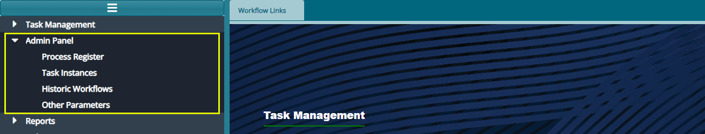
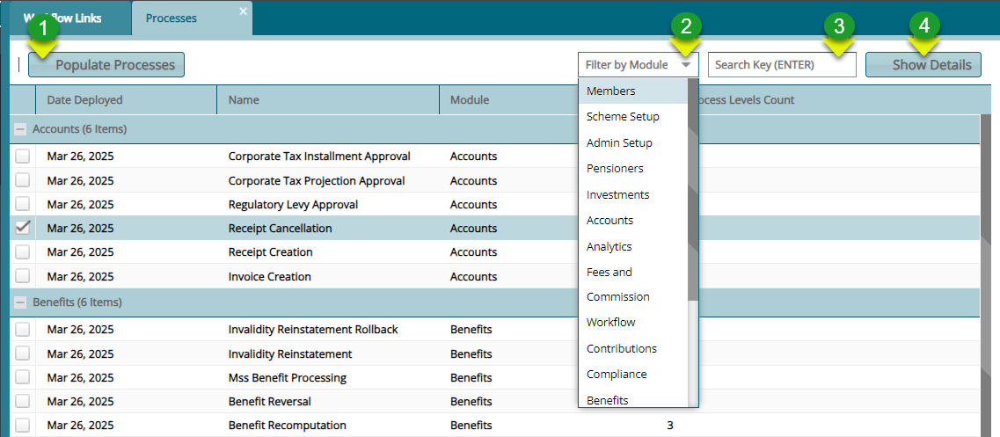
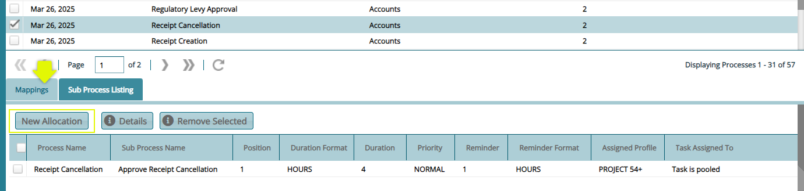
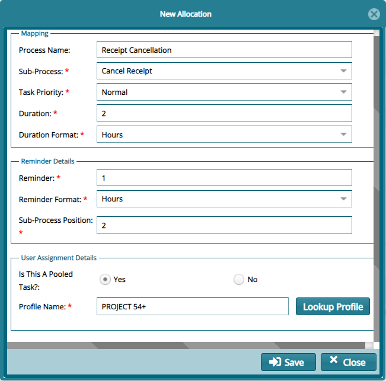
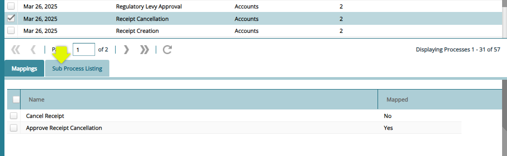
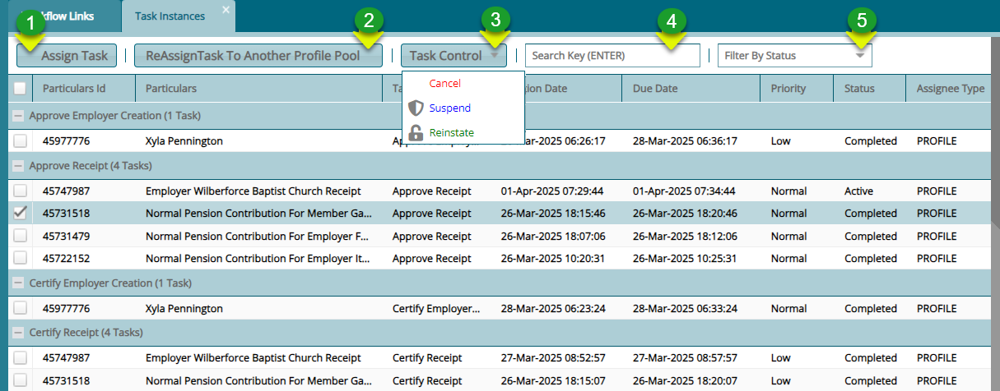
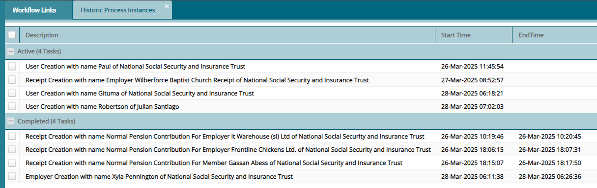
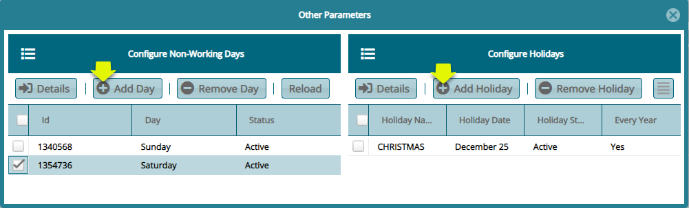
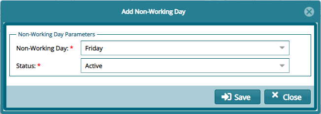
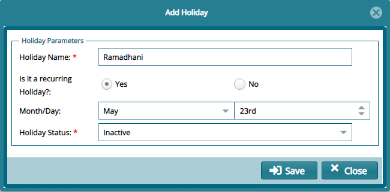

## Admin Panel

The menu items under the **Admin Panel** menu allow access to registers
such as the processes register and task instances, historic workflows
and other parameters. Click the links to open their respective windows
as shown below:

 

### Process Register

Click the **Process Register** link to open the Processes window where
the details for all processes and their different tasks, assigned users,
and other details are displayed in a grid table as shown below:

 

**Action**

-   Click **Label 1** button to populate all the process that can be
    automated in the system.

-   Click **Label 2** button and from the dropdown menu filter processes
    my module.

-   Click **Label 3** text field to type the name of the process to
    filter the records.

-   Click **Label 4** button to expand the window at the bottom to
    display a section showing the details of a selected process from the
    grid table.

Clicking the **Show Details** button will expand the window to display a
section where mappings of processes to assigned to users and listing of
sub processes are accessed as shown below:

 

### *Mapping*

To map processes to assigned users click the **New Allocation** button
from the Mappings tab to open a window where the configurations is done
as shown below:

 

### *Sub Processes*

To view all the sub processes for a selected process, click the **Sub
Processes** tab as shown below:

 

### Task Instances

The **Task Instances** window display all the tasks that have been
completed and those that are still active in the workflow engine. From
this window certain actions such as assigning a task to a user can be
executed. See the screenshot below:

 

**Action**

-   Click **Label 1** button to assign a selected task to a user from a
    pool.

-   Click **Label 2** button to reassign a task a different user.

-   Click **Label 3** button and from the dropdown menu cancel, suspend
    or reinstate a task.

-   Click **Label 4** text box and type word to filter records.

-   Click **Label 5** button and from the dropdown menu selecta filed to
    filter records by task status.

### Historic Process Instances

The **Historic Process Instances** window display all the task
descriptions under two categories. Those that are active and those that
have been completed. See the screenshot below

 

### Other Parameters

The **Other Parameters** window is where non-working days and holidays
are configured in the system. This enables the workflow schedular to
exclude these days in the allocation of tasks to days. To configure a
**Non-Working Day**, click the **Add Day** button to open a dialog box
to set the day and **Add Holiday** button to set a day as **Holiday**
among other settings such as removing a set day as shown below:

 

To configure a non-working day, click the **Add Day** button to open a
dialog box for setting up the day as shown below:

 

To configure a holiday, click the **Add Holiday** button to open a
dialog box for setting up the day as shown below:

 

