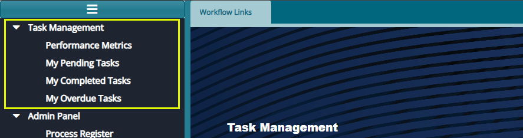
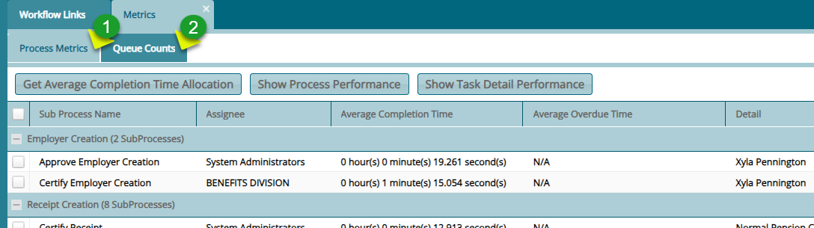
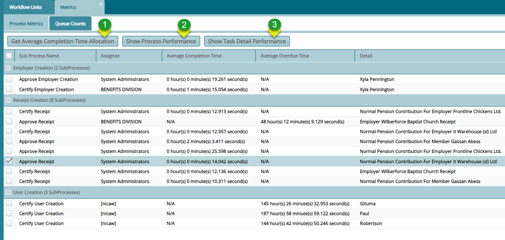
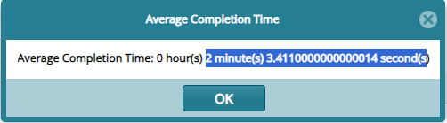
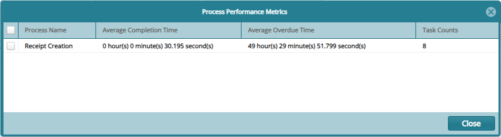
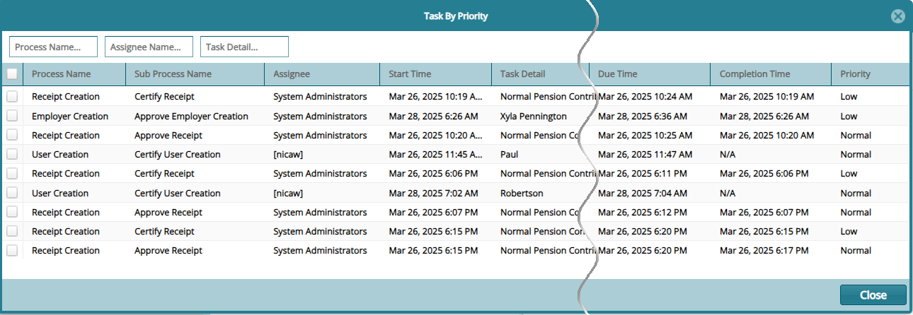
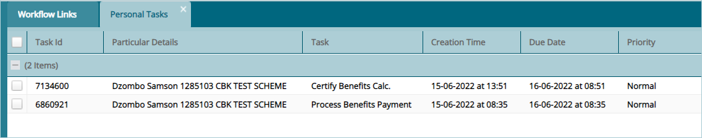
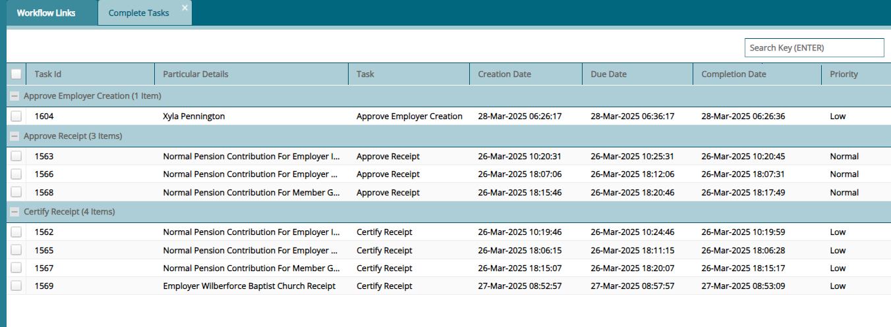
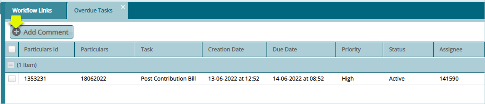

### Task Management

The menu items under the **Task Management** menu allow access to the
categorized task related windows where certain process tasks are
executed from. Click the drop-down menu links to open respective windows
as shown below:

 

### Performance Metrics

Click the **Performance Metrics** link to open the Processes window
where the details for all processes and their different tasks, assigned
users, and other details are displayed in a grid table as shown below:

 

**Action**

-   Click **Label 1** tab to view the performance details of different
    categories of system processes.

-   Click **Label 2** tab to view the performance details of process
    categorized has high or low priority.

#### Process Metrics

The **Process Metrics** help measure the efficiency, effectiveness, and
performance of automated workflows. These metrics provide insights into
how well processes are executed. The metric can give insights into
identification of bottlenecks and ensure optimal resource utilization.
See screenshot below:

 

**Action**

-   Click **Label 1** button to view the average completion time of a
    selected sub process.

-   Click **Label 2** button to view the performance of a selected
    process e.g. the receipt creation process

-   Click **Label 3** button to view the performance details of all
    tasks under a process.

##### Average Completion Time

Clicking the **Get Average Completion Time Allocation** button will open
a window showing the average time taken to complete the selected sub
process. See sample screenshot below:

 

##### Process Performance

Clicking the **Process Performance** button will open a window showing
the process performance e.g. the average time taken to complete the
process. See sample screenshot below:

 

##### Task Detail Performance

Clicking the **Show Task Performance** button will open a window showing
the description of tasks performed and their performance e.g. the
average time taken to complete a specific task. See sample screenshot
below:

 

#### Queue Count

The **Queue Count** help measure the performance of tasks under the
group of those viewed to be of high or low priority. See screenshot
below:

 

**Action**

-   Click **Label 1** button to open a window showing all tasks and
    their priority.

-   **Label 2** section tabulated all the performances.

-   **Label 3** section shows a chart visualizing the tasks performance.

##### Tasks Priority

Clicking the **Get Tasks by Selected Priority** button will open a
window showing all the tasks and their priority among other details. See
sample screenshot below:

 

### My Pending Tasks

Clicking the **My Pending Tasks** menu item will open the **Personal
Tasks** window where the details for all tasks assigned to the current
system user are listed as shown below:

 

### My Completed Tasks

Clicking **My Completed Tasks** menu item will open the **Completed
Tasks** window where the details for all tasks assigned and already
completed by the current system user are listed as shown below:

 

### My Overdue Tasks

Clicking **My Overdue Tasks** menu item will open the **Overdue
Tasks** window where the uncompleted tasks assigned to the current user
are listed as shown below:

 

Click the **Add Comment** button to write a comment related to a
selected task from the list.

