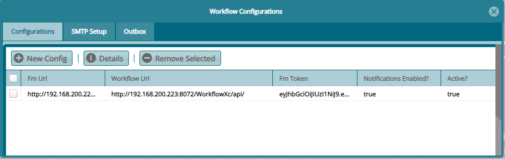
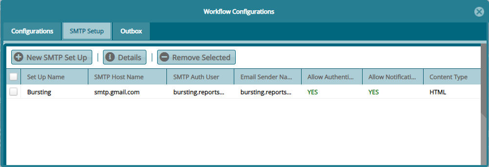
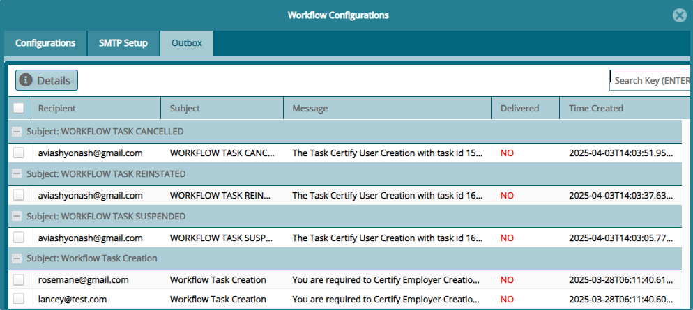

## Workflow Configurations

For the workflow module (which has been designed as a microservice) to
communicate with the core system or other external systems, a specific
configuration needs to be set for this to happen. See the different
workflow configuration below:

### APL Configuration

This window displays the configurations set to connect the workflow to
FundMaster. Click **New Config** button to open a dialog box to
configure a new API:

 

### SMTP Setup

This window displays the configurations set to connect the workflow to a
email service provider for sending of notification messages from the
workflow module. Click **New Config** button to open a dialog box to
setup a new SMPT:

 

### Outbox

This window displays the copies of emails that have been sent from the
workflow. From this window one can also check if a mail has been
delivered by looking at the status on the **Delivery** column as shown
below:
 

